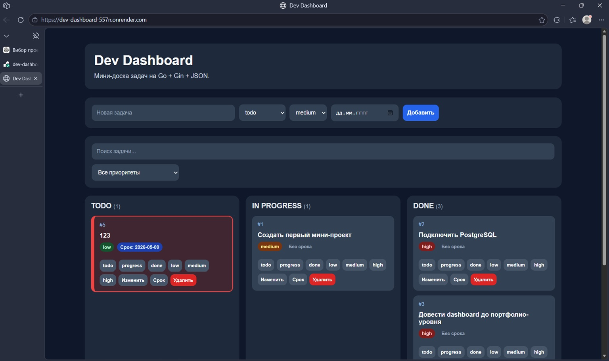

# Dev Dashboard

Публичный мини-dashboard для управления задачами.

Live demo: https://dev-dashboard-557n.onrender.com
GitHub: https://github.com/maystrenkobr-ops/dev-dashboard

## Скриншот

## Описание

Dev Dashboard — это Kanban-доска задач на Go + Gin с веб-интерфейсом и хранением данных в PostgreSQL.

Проект сделан как практический backend/frontend MVP.

## Возможности

- создание задач
- удаление задач
- редактирование названия задачи
- смена статуса: todo / in_progress / done
- приоритеты: low / medium / high
- дедлайны задач
- поиск по задачам
- фильтр по приоритету
- Kanban-доска из трех колонок
- drag-and-drop карточек между колонками
- подсветка просроченных дедлайнов
- PostgreSQL-хранилище на Render
- локальный fallback через data/tasks.json

## Стек

- Go
- Gin
- PostgreSQL
- pgx / pgxpool
- HTML
- CSS
- JavaScript
- Render
- GitHub

## Структура проекта

dev-dashboard/
  cmd/server/main.go
  web/index.html
  web/styles.css
  web/app.js
  data/tasks.json
  go.mod
  go.sum
  README.md
  .gitignore

## API

GET    /tasks
POST   /tasks
PATCH  /tasks/:id/title
PATCH  /tasks/:id/status
PATCH  /tasks/:id/priority
PATCH  /tasks/:id/deadline
DELETE /tasks/:id

## Локальный запуск

go run .\cmd\server\main.go

После запуска открыть:

http://localhost:8080

## Переменные окружения

DATABASE_URL — строка подключения к PostgreSQL.
PORT — порт сервера, на Render задается автоматически.

Если DATABASE_URL не задана, приложение использует локальный JSON-файл data/tasks.json.

## Деплой

Проект задеплоен на Render как Web Service.

Build Command:
go build -o app ./cmd/server

Start Command:
./app

## Статус проекта

Готовый MVP:
- публичный деплой
- PostgreSQL
- рабочий CRUD задач
- Kanban UI
- поиск и фильтры
- хранение данных в базе

## Что можно улучшить дальше

- авторизация пользователей
- Dockerfile
- тесты
- отдельная backend-структура по слоям

